  

<picture>
  <source media="(prefers-color-scheme: light)" srcset="./assets/divider-light.svg" />
  
</picture>

<picture>
  <source media="(prefers-color-scheme: light)" srcset="./assets/header-status-light.svg" />
  
</picture>

  <picture>
    <source media="(prefers-color-scheme: light)" srcset="./assets/terminal-light.svg" />
    
  </picture>

<picture>
  <source media="(prefers-color-scheme: light)" srcset="./assets/header-archive-light.svg" />
  
</picture>

  <picture>
    <source media="(prefers-color-scheme: light)" srcset="./assets/sins-light.svg" />
    
  </picture>

<picture>
  <source media="(prefers-color-scheme: light)" srcset="./assets/header-spirits-light.svg" />
  
</picture>

  <picture>
    <source media="(prefers-color-scheme: light)" srcset="./assets/orbit-light.svg" />
    
  </picture>

<picture>
  <source media="(prefers-color-scheme: light)" srcset="./assets/header-records-light.svg" />
  
</picture>

  <picture>
    <source media="(prefers-color-scheme: light)" srcset="./assets/stats-light.svg" />
    
  </picture>

<picture>
  <source media="(prefers-color-scheme: light)" srcset="./assets/header-loop-light.svg" />
  
</picture>

| Loop | Quest | Status |
| :--: | :-- | :--: |
| `01` | Kuasai TypeScript *strict mode* | `✓ CLEARED` |
| `02` | Bangun REST API pakai NestJS | `✓ CLEARED` |
| `03` | Deep dive *system architecture* | `▶ IN PROGRESS` |
| `04` | Kontribusi open source pertama | `◇ LOCKED` |
| `05` | Selesaikan Re:Zero season 3 | `◇ LOCKED` |

<picture>
  <source media="(prefers-color-scheme: light)" srcset="./assets/divider-light.svg" />
  
</picture>

  <picture>
    <source media="(prefers-color-scheme: light)" srcset="./assets/footer-light.svg" />
    
  </picture>
    
  
   
  every animation on this page is hand-built SVG, drawn over Subaru's endless staircase · <a href="./tools">see how</a>

